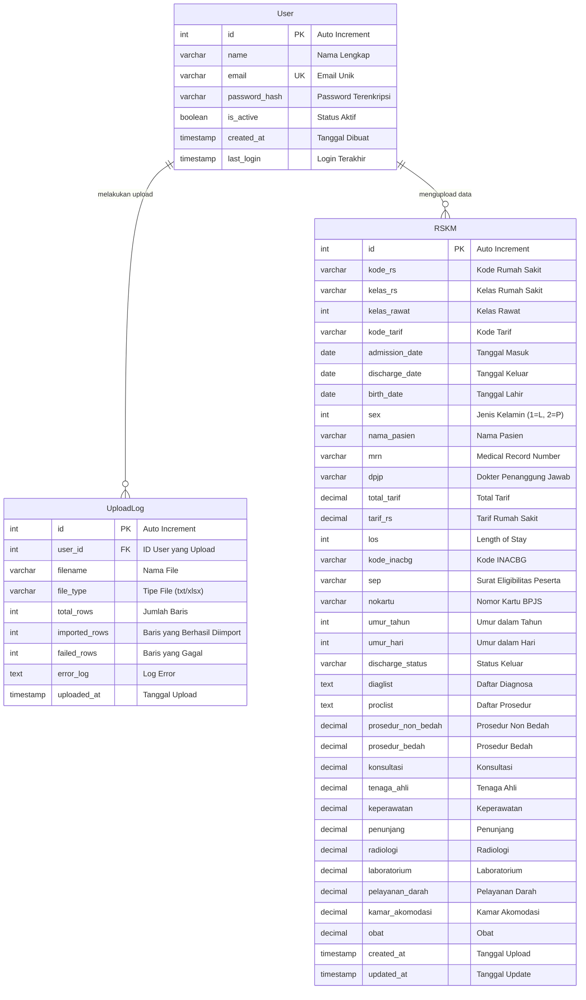

# 🗄️ ERD Database DAV - Struktur Baru

## Overview
Database baru untuk sistem DAV dengan struktur yang disederhanakan:
- **Tabel User**: Untuk manajemen pengguna sistem
- **Tabel RSKM**: Satu tabel untuk semua data RSKM (Rumah Sakit Kelas Menengah)

## 📊 ERD Diagram



## 🏗️ Struktur Tabel

### 1. Tabel `users` (Sudah Ada)
```sql
CREATE TABLE users (
    id SERIAL PRIMARY KEY,
    name VARCHAR(100) NOT NULL,
    email VARCHAR(120) UNIQUE NOT NULL,
    password_hash VARCHAR(255) NOT NULL,
    is_active BOOLEAN DEFAULT TRUE,
    created_at TIMESTAMP DEFAULT CURRENT_TIMESTAMP,
    last_login TIMESTAMP
);
```

### 2. Tabel `rskm` (Baru - Semua Data RSKM)
```sql
CREATE TABLE rskm (
    id SERIAL PRIMARY KEY,
    
    -- Data Rumah Sakit
    kode_rs VARCHAR(20),
    kelas_rs VARCHAR(10),
    kelas_rawat INTEGER,
    kode_tarif VARCHAR(20),
    
    -- Data Pasien
    nama_pasien VARCHAR(255),
    mrn VARCHAR(50),
    birth_date DATE,
    sex INTEGER, -- 1=Laki-laki, 2=Perempuan
    nokartu VARCHAR(20),
    umur_tahun INTEGER,
    umur_hari INTEGER,
    
    -- Data Kunjungan
    admission_date DATE,
    discharge_date DATE,
    los INTEGER, -- Length of Stay
    discharge_status VARCHAR(50),
    
    -- Data Medis
    dpjp VARCHAR(255), -- Dokter Penanggung Jawab
    diaglist TEXT, -- Daftar Diagnosa (pisahkan dengan ;)
    proclist TEXT, -- Daftar Prosedur (pisahkan dengan ;)
    
    -- Data Biaya
    total_tarif DECIMAL(15,2),
    tarif_rs DECIMAL(15,2),
    
    -- Rincian Biaya
    prosedur_non_bedah DECIMAL(15,2) DEFAULT 0,
    prosedur_bedah DECIMAL(15,2) DEFAULT 0,
    konsultasi DECIMAL(15,2) DEFAULT 0,
    tenaga_ahli DECIMAL(15,2) DEFAULT 0,
    keperawatan DECIMAL(15,2) DEFAULT 0,
    penunjang DECIMAL(15,2) DEFAULT 0,
    radiologi DECIMAL(15,2) DEFAULT 0,
    laboratorium DECIMAL(15,2) DEFAULT 0,
    pelayanan_darah DECIMAL(15,2) DEFAULT 0,
    kamar_akomodasi DECIMAL(15,2) DEFAULT 0,
    obat DECIMAL(15,2) DEFAULT 0,
    
    -- Data BPJS
    kode_inacbg VARCHAR(20),
    sep VARCHAR(50),
    
    -- Metadata
    created_at TIMESTAMP DEFAULT CURRENT_TIMESTAMP,
    updated_at TIMESTAMP DEFAULT CURRENT_TIMESTAMP
);
```

### 3. Tabel `upload_logs` (Baru - Log Upload)
```sql
CREATE TABLE upload_logs (
    id SERIAL PRIMARY KEY,
    user_id INTEGER REFERENCES users(id),
    filename VARCHAR(255),
    file_type VARCHAR(10), -- txt, xlsx, xls
    total_rows INTEGER,
    imported_rows INTEGER,
    failed_rows INTEGER,
    error_log TEXT,
    uploaded_at TIMESTAMP DEFAULT CURRENT_TIMESTAMP
);
```

## 🔧 Indeks untuk Performa

```sql
-- Indeks untuk pencarian cepat
CREATE INDEX idx_rskm_mrn ON rskm(mrn);
CREATE INDEX idx_rskm_admission_date ON rskm(admission_date);
CREATE INDEX idx_rskm_discharge_date ON rskm(discharge_date);
CREATE INDEX idx_rskm_nama_pasien ON rskm(nama_pasien);
CREATE INDEX idx_rskm_kode_rs ON rskm(kode_rs);
CREATE INDEX idx_rskm_created_at ON rskm(created_at);

-- Indeks untuk upload logs
CREATE INDEX idx_upload_logs_user_id ON upload_logs(user_id);
CREATE INDEX idx_upload_logs_uploaded_at ON upload_logs(uploaded_at);
```

## 📋 Mapping Kolom File ke Database

### Dari File Input (.txt/.xlsx) ke Tabel `rskm`:

| Kolom File | Kolom Database | Tipe Data | Keterangan |
|------------|---------------|-----------|------------|
| KODE_RS | kode_rs | VARCHAR(20) | Kode Rumah Sakit |
| KELAS_RS | kelas_rs | VARCHAR(10) | Kelas Rumah Sakit |
| KELAS_RAWAT | kelas_rawat | INTEGER | Kelas Rawat |
| KODE_TARIF | kode_tarif | VARCHAR(20) | Kode Tarif |
| ADMISSION_DATE | admission_date | DATE | Tanggal Masuk |
| DISCHARGE_DATE | discharge_date | DATE | Tanggal Keluar |
| BIRTH_DATE | birth_date | DATE | Tanggal Lahir |
| SEX | sex | INTEGER | Jenis Kelamin |
| NAMA_PASIEN | nama_pasien | VARCHAR(255) | Nama Pasien |
| MRN | mrn | VARCHAR(50) | Medical Record Number |
| DPJP | dpjp | VARCHAR(255) | Dokter Penanggung Jawab |
| TOTAL_TARIF | total_tarif | DECIMAL(15,2) | Total Tarif |
| TARIF_RS | tarif_rs | DECIMAL(15,2) | Tarif Rumah Sakit |
| LOS | los | INTEGER | Length of Stay |
| KODE_INACBG | kode_inacbg | VARCHAR(20) | Kode INACBG |
| SEP | sep | VARCHAR(50) | Surat Eligibilitas Peserta |
| NOKARTU | nokartu | VARCHAR(20) | Nomor Kartu BPJS |
| UMUR_TAHUN | umur_tahun | INTEGER | Umur dalam Tahun |
| UMUR_HARI | umur_hari | INTEGER | Umur dalam Hari |
| DISCHARGE_STATUS | discharge_status | VARCHAR(50) | Status Keluar |
| DIAGLIST | diaglist | TEXT | Daftar Diagnosa |
| PROCLIST | proclist | TEXT | Daftar Prosedur |
| PROSEDUR_NON_BEDAH | prosedur_non_bedah | DECIMAL(15,2) | Prosedur Non Bedah |
| PROSEDUR_BEDAH | prosedur_bedah | DECIMAL(15,2) | Prosedur Bedah |
| KONSULTASI | konsultasi | DECIMAL(15,2) | Konsultasi |
| TENAGA_AHLI | tenaga_ahli | DECIMAL(15,2) | Tenaga Ahli |
| KEPERAWATAN | keperawatan | DECIMAL(15,2) | Keperawatan |
| PENUNJANG | penunjang | DECIMAL(15,2) | Penunjang |
| RADIOLOGI | radiologi | DECIMAL(15,2) | Radiologi |
| LABORATORIUM | laboratorium | DECIMAL(15,2) | Laboratorium |
| PELAYANAN_DARAH | pelayanan_darah | DECIMAL(15,2) | Pelayanan Darah |
| KAMAR_AKOMODASI | kamar_akomodasi | DECIMAL(15,2) | Kamar Akomodasi |
| OBAT | obat | DECIMAL(15,2) | Obat |

## 🚀 Keuntungan Struktur Baru

### 1. **Sederhana**
- Hanya 3 tabel utama (users, rskm, upload_logs)
- Tidak ada relasi kompleks
- Mudah dipahami dan maintain

### 2. **Fleksibel**
- Semua data RSKM dalam satu tabel
- Mudah untuk query dan analisis
- Support untuk kolom tambahan di masa depan

### 3. **Performa**
- Indeks yang optimal
- Query yang cepat
- Tidak perlu join kompleks

### 4. **Upload Mudah**
- Mapping langsung dari file ke tabel
- Support TXT dan Excel
- Logging upload yang detail

## 📊 Contoh Query

### Query Data Pasien
```sql
SELECT 
    nama_pasien,
    mrn,
    admission_date,
    discharge_date,
    los,
    total_tarif
FROM rskm 
WHERE admission_date >= '2024-01-01'
ORDER BY admission_date DESC;
```

### Query Analisis Biaya
```sql
SELECT 
    kode_rs,
    COUNT(*) as total_pasien,
    AVG(total_tarif) as rata_rata_tarif,
    SUM(total_tarif) as total_biaya
FROM rskm 
GROUP BY kode_rs
ORDER BY total_biaya DESC;
```

### Query Upload History
```sql
SELECT 
    u.name,
    ul.filename,
    ul.total_rows,
    ul.imported_rows,
    ul.uploaded_at
FROM upload_logs ul
JOIN users u ON ul.user_id = u.id
ORDER BY ul.uploaded_at DESC;
```

